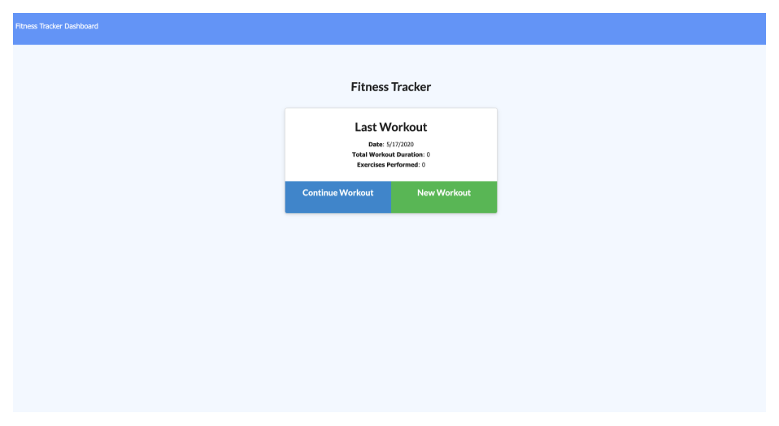
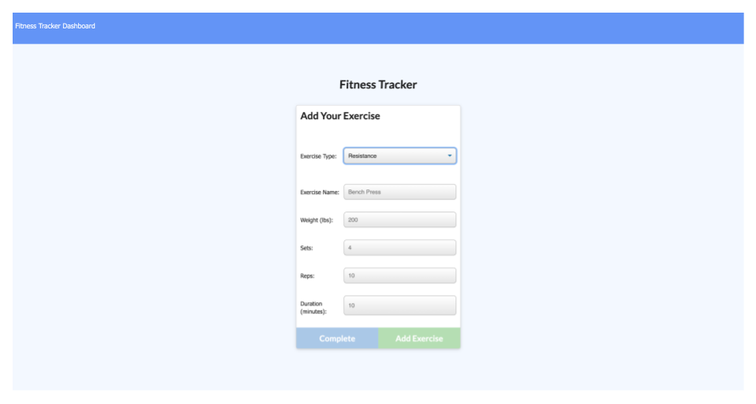
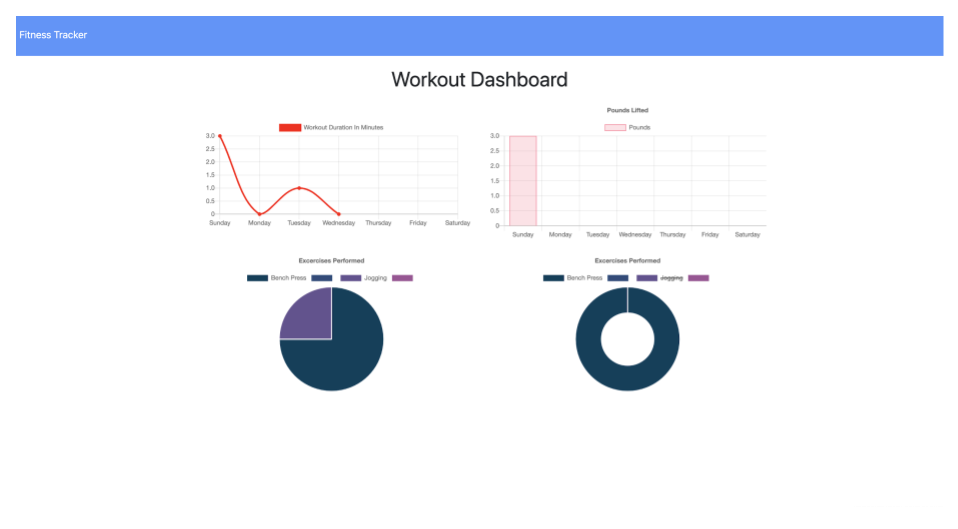

[](https://www.contributor-covenant.org/version/2/0/code_of_conduct/)

# **Fitness Tracker**

# Table of Contents

- [Project Description](#project-description)
- [Installation](#installation)
- [Usage](#usage)
- [Tests](#tests)
- [License](#license)
- [Contributions](#contributions)
- [Questions](#questions)

# Project Description

In this project, a user can create and track their workouts as well as add exercises to an existing workout. The application also provides a user with graphs so that they can track their progress.

# Installation

The following packages will need to be installed in order for the application to work: Express, Mongoose, and Morgan. A user can install the packages by typing the following command in the terminal:

```sh
npm i
```

Note: Prior to running the command, change directories into where the 'package.json' file is located.

# Usage

The application is located here: [Fitness Tracker](https://peaceful-forest-29536.herokuapp.com/). If no workouts exist, one can click on the "New Workout" button. If a workout does exist, a user can click on either the "Continue Workout" or "New Workout" button. The user will then have the option to select what type of exercise they would like to do. The name of an exercise and any associated data can then be entered. Clicking on the "Dashboard" link displays a user's progress using various graphs.

# Tests

Tests can be conducted locally using a Mongo database.

# License

Licensed under the [MIT License](https://spdx.org/licenses/MIT.html).

# Contributions

This project is currently not accepting any contributions.

# Questions

If you have any questions, please contact the project owner by clicking on the email listed below.

#### gscalica@gmail.com

# Screenshots

  
  
  

# Functionality Demonstration 
